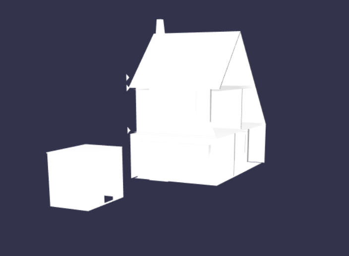
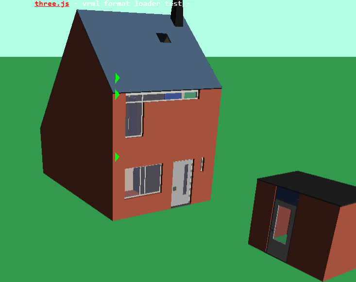

# Simple VRML parser for BabylonJS

Use and based on https://github.com/bartmcleod/VrmlParser 

Based on THREEJS VRMLLoader

## Todo

Everything :

* Material
* Faceset Data :
  * All data
  * Normal that work
  * UVS
* Performance :
  * Try small.wrl and you will understand
* Why I mirror?!

## Try

I put two model, one from ThreeJs and one from my work.

Result for now :

Compare to three.js :

